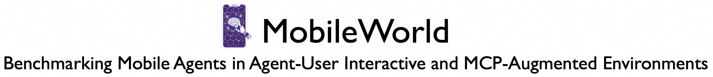
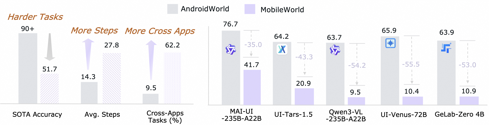
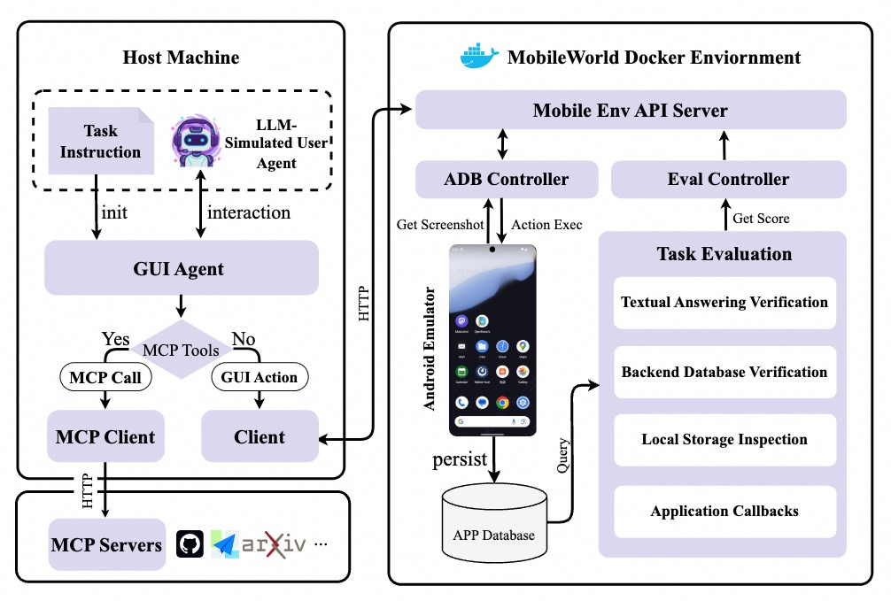
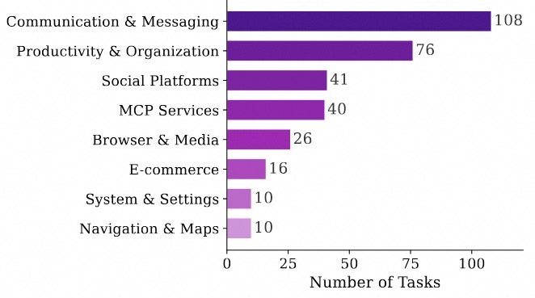
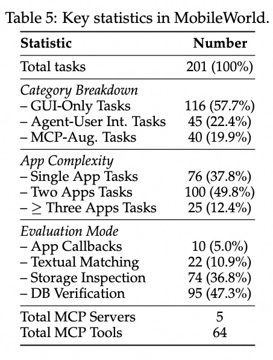

<p align="center">
  
</p>


<p align="center">
  <a href="https://tongyi-mai.github.io/MobileWorld/#leaderboard">Leaderboard</a> •
  <a href="https://tongyi-mai.github.io/MobileWorld/">Website</a> •
  <a href="https://arxiv.org/abs/2512.19432">Paper</a> •
  <a href="https://github.com/Tongyi-MAI/MobileWorld/tree/main/docs">Docs</a> •
  <a href="https://github.com/Tongyi-MAI/MobileWorld/issues">Issues</a>
</p>

<p align="center">
    <a href="https://img.shields.io/badge/PRs-Welcome-red">
        
    </a>
    <a href="https://img.shields.io/github/last-commit/Tongyi-MAI/MobileWorld?color=green">
        
    </a>
    <a href="https://opensource.org/licenses/Apache-2.0">
        
    </a>
    <a href="https://img.shields.io/badge/Python-3.12-blue.svg">
        
    </a>

</p>


> [!IMPORTANT]
> **AgentSentinel research workspace.** This tree is the instrumented
> MobileWorld benchmark/runtime host used by AgentSentinel; the original
> upstream MobileWorld documentation continues below.
>
> **Status (2026-08-31):** Epic 1 and G1.1-G1.3 are complete; G1.4 and G1.5 have
> bounded engineering closes while formal live/replay readiness remains deferred to G1.7. We collected and audited the
> same canonical 117-task GUI-only suite for MAI-UI-8B, Qwen3-VL-8B,
> GELab-Zero-4B, UI-Venus-1.5-8B, GUI-Owl-1.5-8B-Instruct, and
> MemGUI-8B-SFT: 702 model-task cases across six host-native history
> representations. Strict misleading-history reuse appeared in 116 cases /
> 272 chains; 94 cases / 239 chains had observed local harm. A separate
> outcome-aware review found 10 final-decision stops and 48 earlier
> unrecovered derailments with a traceable connection to final failure
> (58/574 failures).
>
> These findings are observational and remain
> `causal_claim_supported=false`; they do not establish a model ranking,
> prove that history alone caused failure, or estimate the benefit of removing
> history. G1.1's immutable pre-gold registry, G1.2's portable History IR,
> codec, validator, schema, and sidecar contracts, and G1.3's immutable decision
> capsules are complete. ALE-321 / G1.3 formally published 190 CPU-only capsules
> (152 strict-MHR candidates plus 38 selected clean controls) with zero
> exclusions from Collector v1 artifacts. The separate 38 reserve controls
> remain census-only and out of capsule/exclusion scope. Contract Amendment 1
> corrected the explicit fail-closed authorization guards in the v1.1
> content-addressed publication; the former v1 publication remains immutable
> and is superseded for formal G1 use. ALE-322 / G1.4 is closed only under
> D-035's bounded engineering scope as `NONFORMAL_LIVE_SMOKE_PASSED`; formal
> replay remains `DEFERRED_TO_G1_7_NOT_AUTHORIZED`. ALE-323 / G1.5 is likewise
> closed only under D-036's bounded engineering scope as
> `CPU_CODEC_IMPLEMENTATION_COMPLETE_NONFORMAL_COMPATIBILITY_PASSED`; formal
> live readiness remains `DEFERRED_TO_G1_7_NOT_AUTHORIZED`. The accepted G1.5
> delivery includes the Qwen flat-progress and MAI raw-replay CPU Codecs,
> five-arm preview/conformance, content-bound publication, and fail-closed
> runner integration. The ten D-035 calls are non-formal prompt/parser
> compatibility observations only and did not execute the formal History
> Codec-to-Provider Codec path. Both v1 Codecs remain `live_ready=false`.
> Formal Provider Codec, complete attempt evidence, serving/backend/session/KV
> isolation, live admission, and replay authority are G1.7 duties and remain
> unauthorized. ALE-324 has a private loopback-only manual-curation workspace
> checkpoint.
> Commit `3f7ccbef542aa37664fe2fb74ab54551ac5d5405` adds the isolated
> `SOLO_FIRST_PASS` for the currently sole curator: Action Gold, then
> Transformation, then preliminary Consistency over all 190 units. These locks
> are explicitly non-formal, do not count as independent reviews, and cannot be
> promoted or exported as formal evidence. D-031 adds three already-frozen,
> blind Agent A/B/C candidate streams for Action Gold. Every candidate remains
> untrusted and non-authoritative. D-032 provides the owner-only three-choice
> review plus a separate server-derived non-formal lock; opening manual editing
> disables that simple path. The site still cannot generate, rank, vote, merge,
> bulk-accept, or silently autosave AI output. D-033 separately binds the four
> owner-authored Action locks and publishes the remaining 186 units, reviewed by
> three fresh isolated 62-unit Codex shards, as content-addressed
> `AI_ONLY_ACTION_LABELS`. Those labels have `human_review_performed=false`,
> never enter either annotation journal, do not open Transformation, and cannot
> be promoted or treated as gold. The candidate campaign records
> `ai_semantic_suggestion_performed=true`, while D-033 records
> `ai_semantic_labeling_performed=true`; neither invokes the target actor model
> or any project provider client/call.
> External-network calls, GPU use,
> MobileWorld/generated GUI/action execution, live replay, and treatment-response
> generation remain unauthorized. Human clicks in the private annotation site
> are curation inputs and are never executed as MobileWorld actions.
> Formal capsules retain their three false safety guards. ALE-322 is closed only
> under D-035 as `NONFORMAL_LIVE_SMOKE_PASSED`, and ALE-323 is closed only under
> D-036 as `CPU_CODEC_IMPLEMENTATION_COMPLETE_NONFORMAL_COMPATIBILITY_PASSED`;
> both formal readiness axes remain `DEFERRED_TO_G1_7_NOT_AUTHORIZED`. Follow the
> [inert-preparation contract](../mobileworld_audit_handoff/G1_EXACT_REQUEST_REPLAY_LIVE_PREPARATION_CONTRACT_V1.md),
> [AI-candidate amendment](../mobileworld_audit_handoff/G1_6_AI_ACTION_CANDIDATE_ASSISTANCE_AMENDMENT_V1.md),
> [AI-only label amendment](../mobileworld_audit_handoff/G1_6_AI_ONLY_ACTION_LABELS_AMENDMENT_V1.md),
> [G1.6 workspace runbook](../mobileworld_audit_handoff/G1_6_ANNOTATION_WORKSPACE_RUNBOOK.md),
> and [project status](../mobileworld_audit_handoff/STATUS.md). ALE-324 remains
> exactly `IN_PROGRESS_HUMAN_CURATION_REQUIRED`, not formal G1.6 completion.
>
> See the [six-model Markdown audit](<../motivation study/misleading_history_audit_report.md>),
> [fixed PDF](<../motivation study/misleading_history_audit_report_20260825.pdf>),
> [content-addressed report assets](<../motivation study/report_assets/>),
> [machine-readable result projection](<../motivation study/epic1_failure_link_audit_v1/>), and
> [workspace overview](../README.md). The public evidence set is an owner-approved exception
> limited to the report's 39 screenshots and one PDF. It contains synthetic/demo fixture values
> and third-party UI/imagery with independently unverified redistribution rights; Git history may
> retain the bytes after deletion. Medical-looking screenshot text is benchmark evidence, not
> medical advice or endorsement. All other raw research data remains repo-external.


While maintaining the same level of rigorous, reproducible evaluation as AndroidWorld, **MobileWorld** offers a more challenging online mobile-use benchmark by introducing four additional features that better capture real-world agent behavior.

- 🎯 **Broad Real-World Coverage**: 201 carefully curated tasks across 20 mobile applications
- 🔄 **Long-Horizon Tasks**: Multi-step reasoning and cross-app workflows
- 👥 **Agent-User Interaction**: Novel tasks requiring dynamic human-agent collaboration
- 🔧 **MCP-Augmented Tasks**: Support Model Context Protocol (MCP) to evaluate hybrid tool usage

<p align="center">
  
  <br>
  <em>Difficulty comparison between MobileWorld and AndroidWorld</em>
</p>

## 📢 Updates
- **2026-07-30: [**Qwen-UI-Agent**](https://tongyi-mai.github.io/Qwen-UI-Agent) Reports 82.1% on MobileWorld🚀**: the follow-up to [MAI-UI](https://github.com/Tongyi-MAI/MAI-UI), reports **82.1%** on MobileWorld.
- **2026-07-29:** Added **Kimi-K3** (74.4% GUI-Only) and **GPT-5.6-Sol** (70.1% GUI-Only) to the [leaderboard](https://tongyi-mai.github.io/MobileWorld/#leaderboard), with full trajectories browsable in the [trajectory viewer](https://tongyi-mai.github.io/MobileWorld/#leaderboard) and [arena](https://tongyi-mai.github.io/MobileWorld/arena).
- **2026-04-29: Head-to-Head Arena & Community Submissions🔥**
    * 🆚 **New Arena Comparison Page:** Compare any two models side-by-side at [tongyi-mai.github.io/MobileWorld/arena](https://tongyi-mai.github.io/MobileWorld/arena). Renders both trajectories step-by-step with screenshots and thinking traces, plus a confusion matrix to filter tasks by outcome (both pass / both fail / one wins / the other wins).
    * 📤 **Submit Your Results:** Community-contributed trajectories are now accepted via [`site/bundle_trajs.py`](site/bundle_trajs.py). See [docs/submit.md](docs/submit.md).
    * 📊 **Trajectories now browsable for:** Claude-Opus-4.7 (56.4% GUI / 59.1% User-Int), Claude-Opus-4.6 (44.5% / 34.1%), Kimi-K2.6 (55.6% / 56.8%), Kimi-K2.5 (49.6% / 51.2%), Seed-2.0-Pro (63.2% / 61.4%).
- **2026-04-22:** Added **Claude-Opus-4.7** (56.4% GUI-Only) and **Kimi-K2.6** (55.6% GUI-Only) to the [leaderboard](https://tongyi-mai.github.io/MobileWorld/#leaderboard). Trajectory viewer now available for inspecting per-task agent traces.
- **2026-04-15: Important Fix — Mattermost Session Expiry**
    If you pulled the Docker image before this date, Mattermost task evaluations may produce **false negatives** due to expired authentication tokens in the emulator snapshot. Please **`git pull`** the latest codebase — the fix runs automatically during task initialization (no Docker image rebuild required).

See [CHANGELOG.md](CHANGELOG.md) for the full release history.


## 📋 Table of Contents
- [Updates](#-updates)
- [Overview](#-overview)
- [Installation](#-installation)
- [Quick Start](#-quick-start)
- [Testing on Real Devices](#-testing-on-real-devices)
- [Available Commands](#-available-commands)
- [Documentation](#-documentation)
- [Submit Your Results](#-submit-your-results)
- [Benchmark Statistics](#-benchmark-statistics)
- [Contact](#-contact)
- [Acknowledgements](#-acknowledgements)
- [Citation](#-citation)


---

## 📖 Overview

<p align="center">
  
</p>

MobileWorld is a comprehensive benchmark for evaluating autonomous mobile agents in realistic scenarios. Our benchmark features a robust infrastructure and deterministic evaluation methodology:

### 🏗️ System Architecture

**Containerized Environment**  
The entire evaluation environment runs in Docker-in-Docker containers, including:
- Rooted Android Virtual Device (AVD)
- Self-hosted application backends
- API server for orchestration

This design eliminates external dependencies and enables consistent deployment across different host systems.

**Open-Source Applications**  
We build stable, reproducible environments using popular open-source projects:
- **Mattermost**: Enterprise communication (Slack alternative)
- **Mastodon**: Social media platform (X/Twitter alternative)  
- **Mall4Uni**: E-commerce platform

Self-hosting provides full backend access, enabling precise control over task initialization and deterministic verification.

**Snapshot-Based State Management**  
AVD snapshots capture complete device states, ensuring each task execution begins from identical initial conditions for reproducible results.

### ✅ Task Evaluation

We implement multiple complementary verification methods for reliable assessment:

- **Textual Answer Verification**: Pattern matching and string comparison for information retrieval tasks
- **Backend Database Verification**: Direct database queries to validate state changes (messages, posts, etc.)
- **Local Storage Inspection**: ADB-based inspection of application data (calendar events, email drafts, etc.)
- **Application Callbacks**: Custom APIs capturing intermediate states for validation

## 💾 Installation

### System Requirements

- **Docker** with privileged container support
- **KVM** (Kernel-based Virtual Machine) for Android emulator acceleration
- **Python 3.12+**
- **Linux** host system (or Windows with WSL2 + KVM enabled), MacOS support is in progress.

### Quick Install

```bash
# Clone the repository
git clone https://github.com/Tongyi-MAI/MobileWorld.git
cd MobileWorld

# Install dependencies with uv
uv sync
```

### Environment Configuration

Create a `.env` file from `.env.example` in the project root:

```bash
cp .env.example .env
```

Edit the `.env` file and configure the following parameters:

**Required for Agent Evaluation:**
- `API_KEY`: Your OpenAI-compatible API key for the agent model
- `USER_AGENT_API_KEY`: API key for user agent LLM (used in agent-user interactive tasks)
- `USER_AGENT_BASE_URL`: Base URL for user agent API endpoint
- `USER_AGENT_MODEL`: Model name for user agent (e.g., `gpt-4.1`)

**Required for MCP-Augmented Tasks:**
- `DASHSCOPE_API_KEY`: DashScope API key for MCP services
- `MODELSCOPE_API_KEY`: ModelScope API key for MCP services

**Example `.env` file:**
```bash
API_KEY=your_api_key_for_agent_model
DASHSCOPE_API_KEY=dashscope_api_key_for_mcp
MODELSCOPE_API_KEY=modelscope_api_key_for_mcp

USER_AGENT_API_KEY=your_user_agent_llm_api_key
USER_AGENT_BASE_URL=your_user_agent_base_url
USER_AGENT_MODEL=gpt-4.1
```

> **Note**: 
> - MCP API keys are only required if you plan to run MCP-augmented tasks
> - User agent settings are only required for agent-user interactive tasks
> - See [MCP Setup Guide](docs/mcp_setup.md) for detailed MCP server configuration

---

## 🚀 Quick Start

### 1. Check Environment & Pull Docker Image

```bash
sudo uv run mw env check
```

This command verifies Docker, KVM support, and prompts to pull the latest `mobile_world` Docker image if needed.

### 2. Launch Docker Containers

```bash
sudo uv run mw env run --count 5 --launch-interval 20
```

This launches 5 containerized Android environments with:
- `--count 5`: Number of parallel containers
- `--launch-interval 20`: Wait 20 seconds between container launches

### 3. Run Evaluation

```bash
sudo uv run mw eval \
    --agent_type qwen3vl \
    --task ALL \
    --max_round 50 \
    --model_name Qwen3-VL-235B-A22B \
    --llm_base_url [openai_compatible_url] \
    --step_wait_time 3 \
    --log_file_root traj_logs/qwen3_vl_logs \
    --enable_mcp \
    --enable_user_interaction
```

> **Flags:**
> - `--enable_mcp`: Include MCP-augmented tasks in evaluation
> - `--enable_user_interaction`: Include agent-user interaction tasks. Without this flag, only GUI-only tasks are evaluated.

### 4. View Results

```bash
uv run mw logs view --log_dir traj_logs/qwen3_vl_logs
```

Opens an interactive web-based visualization at `http://localhost:8760` to explore task trajectories and results.

---

## 📱 Testing on Real Devices

Beyond the containerized emulator, MobileWorld can drive **real Android phones** via ADB — evaluating frontier models (Claude, Gemini, Qwen, Kimi, Seed-2.0-Pro, …) as true end-to-end mobile agents. See [docs/real-devices.md](docs/real-devices.md) for the setup walkthrough and the per-model coordinate-system reference.

---

## 🔧 Available Commands

MobileWorld provides a comprehensive CLI (`mw` or `mobile-world`) with the following commands:

| Command           | Description                                             |
|-------------------|---------------------------------------------------------|
| `mw env check`    | Check prerequisites (Docker, KVM) and pull latest image |
| `mw env run`      | Launch Docker container(s) with Android emulators       |
| `mw env list`     | List running MobileWorld containers                     |
| `mw env rm`       | Remove/destroy containers                               |
| `mw env info`     | Get detailed info about a container                     |
| `mw env restart`  | Restart the server in a container                       |
| `mw env exec`     | Open a shell in a container                             |
| `mw eval`         | Run benchmark evaluation suite                          |
| `mw test`         | Run a single ad-hoc task for testing                    |
| `mw info task`    | Display available tasks                                 |
| `mw info agent`   | Display available agents                                |
| `mw info app`     | Display available apps                                  |
| `mw info mcp`     | Display available MCP tools                             |
| `mw logs view`    | Launch interactive log viewer                           |
| `mw logs results` | Print results summary table                             |
| `mw logs export`  | Export logs as static HTML site                         |
| `mw device`       | View live Android device screen                         |
| `mw server`       | Start the backend API server                            |

Use `mw <command> --help` for detailed options.

---

## 📚 Documentation

For detailed documentation, see the `docs/` directory:

| Document                                   | Description                                         |
|--------------------------------------------|-----------------------------------------------------|
| [Development Guide](docs/development.md)   | Dev mode, debugging, container management workflows |
| [Real Device Setup](docs/real-devices.md)  | Run frontier models on a physical Android phone     |
| [Submit Your Results](docs/submit.md)      | Bundle trajectories and contribute to the leaderboard |
| [MCP Setup](docs/mcp_setup.md)             | Configure MCP servers for external tool integration |
| [Windows Setup](docs/setup_for_windows.md) | WSL2 and KVM setup instructions for Windows         |
| [AVD Configuration](docs/configure_avd.md) | Customize and save Android Virtual Device snapshots |

---

## 📤 Submit Your Results

Have a trajectory run from a new model or agent configuration? We accept community contributions to the [leaderboard](https://tongyi-mai.github.io/MobileWorld/#leaderboard) and [arena](https://tongyi-mai.github.io/MobileWorld/arena).

1. Bundle your `traj_logs/<run>` directory with [`site/bundle_trajs.py`](site/bundle_trajs.py) (use `--with-screenshots` to include arena-viewable frames).
2. Open a [GitHub issue](https://github.com/Tongyi-MAI/MobileWorld/issues) attaching the resulting `.json.gz` (+ optional `.mp4`) and a draft `site/leaderboard.json` entry.

See [docs/submit.md](docs/submit.md) for the bundling commands, the full leaderboard-entry schema, and the asset-repo upload flow.

---

## 🎯 Benchmark Statistics

<table align="center">
  <tr>
    <td></td>
    <td></td>
  </tr>
</table>


## 📬 Contact

For questions, issues, or collaboration inquiries:

- **GitHub Issues**: [Open an issue](https://github.com/Tongyi-MAI/MobileWorld/issues)
- **Email**: Contact the maintainers
- **Discord**: [Join our Discord server](https://discord.gg/yuX6t5qs)
- **WeChat Group**: Scan to join our discussion group

<p align="center">
  
</p>


## Acknowledgements

We thank [Android World](https://github.com/google-research/android_world) and [Android-Lab](https://github.com/THUDM/Android-Lab) for their open source contributions.
We also thank all the open-source contributors!

<a href="https://github.com/Tongyi-MAI/MobileWorld/graphs/contributors">
  
</a>


## Citation

If you find MobileWorld useful in your research, please cite our paper:

```bibtex
@inproceedings{kong2025mobileworld,
      title={MobileWorld: Benchmarking Autonomous Mobile Agents in Agent-User Interactive, and MCP-Augmented Environments},
      author={Quyu Kong and Xu Zhang and Zhenyu Yang and Nolan Gao and Chen Liu and Panrong Tong and Chenglin Cai and Hanzhang Zhou and Jianan Zhang and Liangyu Chen and Zhidan Liu and Steven Hoi and Yue Wang},
      booktitle={Proceedings of the 64th Annual Meeting of the Association for Computational Linguistics (ACL)},
      year={2026},
      url={https://arxiv.org/abs/2512.19432},
}
```

---

## ⭐ Star History

If you find MobileWorld helpful, please consider giving us a star ⭐!

[](https://star-history.com/#Tongyi-MAI/MobileWorld&Date)
